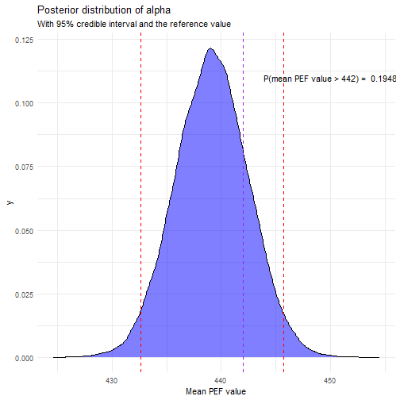
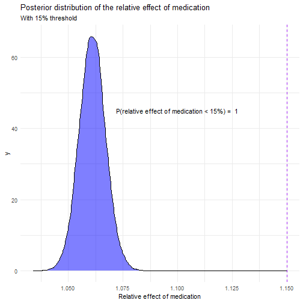
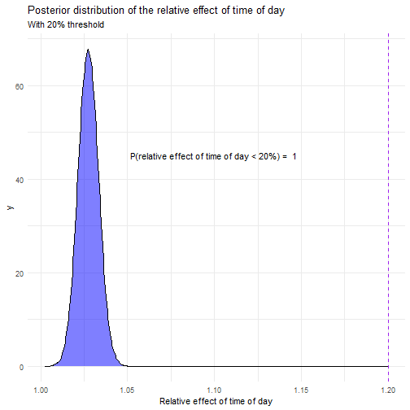

### 1. Introduction

In this document, we will analyze the peak expiratory flow (PEF) values of a person in order to gather evidence whether the person might have asthma or not. These values alone are not enough to make a diagnosis, but they can be used as a part of the diagnostic process.

The data consists of PEF-values measured in the morning and in the evening. Six measurements are taken each time, three before and three after taking asthma medication. The data was gathered over a period of seven days. 


We consider the following to be evidence for asthma: 

1. The relative effect of medication (variable name $\textit{treatment}$) is over 15$\%$ with at least 3/14 probability.

2. The relative effect of time of day (variable name $\textit{circadian}$) is over 20$\%$ with at least 3/14 probability.

And last, the reference value for the mean PEF-value for the person in question (variable name $\alpha$) is 442.


### 2. Model

The model we will use is a Bayesian linear model. We will model the PEF measurements as a linear combination of the medication effect, the time of day effect, and the day of the week effect. The model is defined as follows:

$y \sim N(\alpha + \beta_1  x + \beta_2  t + \beta_3  d, \sigma)$,

where: $\alpha$ is the intercept, $x$ is the medication indicator, $t$ is the time of day indicator, $d$ is the day of the week, and $\sigma$ is the standard deviation.

We will use weakly informative normal prior distributions for the parameters. The intercept $\alpha$ is given a normal prior with mean 400 and standard deviation 100. The effects of medication, time of day, and day of the week are given normal priors with mean 0 and standard deviation 100. The standard deviation $\sigma$ is given a half-normal prior with standard deviation 100.

### 3. Analysis

#### 3.1. Model in Stan

Let us define a Bayesian linear mode for the PEF measurements in Stan and draw samples from the posterior distribution.


```stan
data {
  int<lower=0> N; // number of observations
  array[N] real<lower=0> y; // PEF measurements
  array[N] int<lower=0,upper=1> x; // medication indicator (0=before, 1=after)
  array[N] int<lower=0,upper=1> t; // time of day indicator (0=morning, 1=evening)
  array[N] int<lower=1,upper=7> d; // day of the follow-up
}

parameters {
  real alpha; // intercept
  real treatment; // effect of medication
  real circadian; // effect of time of day
  real followup; // effect of day of the week
  real<lower=0> sigma; // standard deviation
}

transformed parameters {
  vector[N] mu;
  for (n in 1:N) {
    mu[n] = alpha + treatment * x[n] + circadian * t[n] + followup * d[n];
  }
}

model {
  // priors
  alpha ~ normal(400, 100); // weakly informative prior for the intercept
  treatment ~ normal(0, 100); // weakly informative prior for the effect of medication
  circadian ~ normal(0, 100); // weakly informative prior for the effect of time of day
  followup ~ normal(0, 100); // weakly informative prior for the effect of day of the week
  sigma ~ normal(0, 100); // half-normal due to constraint for the standard deviation

  // likelihood
  y ~ normal(mu, sigma);
}

generated quantities {
  vector[N] log_lik;
  for (n in 1:N) {
    log_lik[n] = normal_lpdf(y[n] | mu[n], sigma);
  }
}
```


#### 3.2. Diagnostics

Let's check diagnostics.


```
##                  mean     se_mean        sd     Rhat
## alpha     439.1343137 0.021524788 3.3541766 1.000233
## treatment  26.7959532 0.013432821 2.5682040 1.000425
## circadian  12.0455510 0.013537367 2.5379189 1.000046
## followup   -0.3990603 0.003775752 0.6375284 1.000102
## sigma      11.6342429 0.004888435 0.9418185 1.000674
```

$\hat R$ diagnostic values are below 1.01, which indicates that the chains have converged. Let's move onto the analysis.

#### 3.3. Results

Lets plot the posterior distribution of $\alpha$ (the mean value) with a 95$\%$ credible interval, with the reference value of 442.



The probability that $\alpha > 442$ is approximately 0.19$\%$.



Both the relative effect of medication and time of day are less than the thresholds of 15$\%$ and 20$\%$, respectively, with probabilities of 1 and 1.

No strong evidence for the person having asthma is present.

