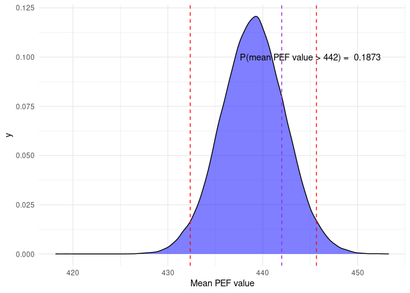
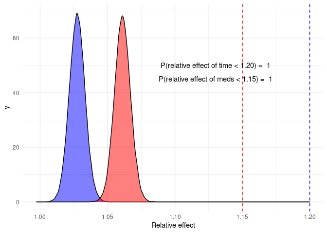

PEF
================
Johannes Rajala
2024-04-19

### PEF-values and asthma

In this document the PEF-values of a person will be analyzed in order to
determine whether the person might have asthma or not. The data consists
of PEF-values measured in the morning and in the evening. Six
measurements are taken each time, three before and three after taking
asthma medication. The data also contains the day of the week.

Asthma: if the relative effect of medication is over 15$\%$ with at
least 3/14 probability OR the relative effect of time of day is over
20$\%$ with at least 3/14 probability, evidence for asthma is present. A
reference value for the mean PEF-value for the person in question is 442
liters per minute.

Let us define a Bayesian linear model for the PEF measurements and draw
samples from the posterior distribution.

Lets plot the posterior distribution of $\alpha$ (the mean value) with a
95$\%$ credible interval, with the reference value of 442.

<!-- -->

The credible interval covers the reference value of 442, and the
probability that $\alpha > 442$ is approximately 0.19$\%$.

<!-- -->

Both the relative effect of medication and time of day are less than the
thresholds of 15$\%$ and 20$\%$, respectively, with probabilities of 1
and 1.
